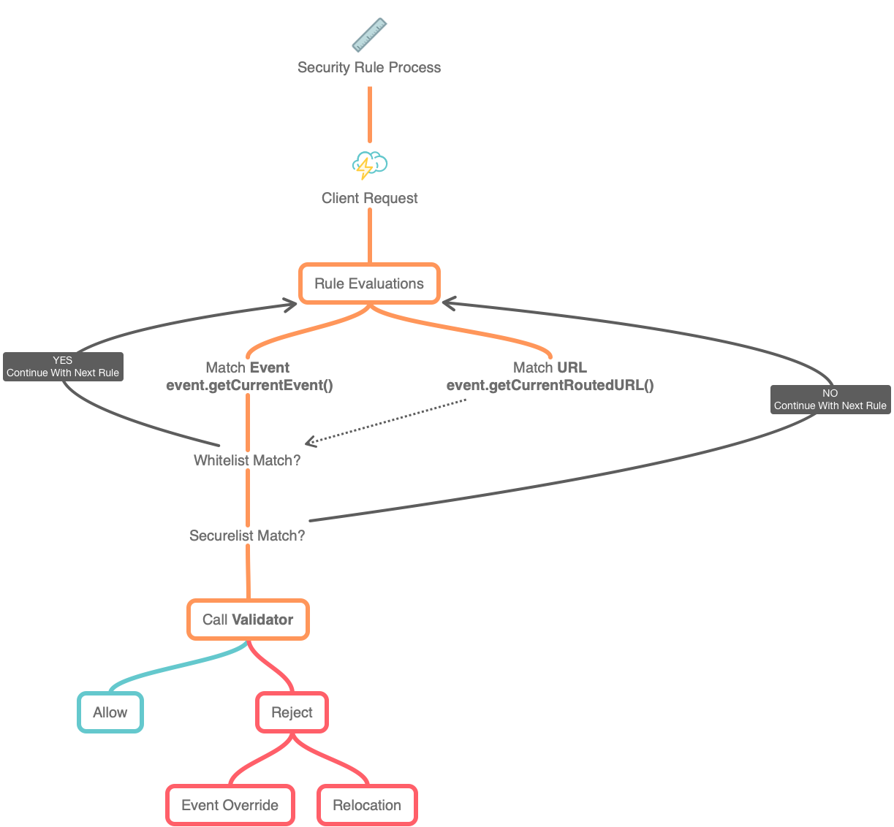

# Security Rules

We have seen how the module works on the concept of rules and how to declare them. Before we dig  deeper and decompose the rules let's have a look at the processing of the rules first.

## Rule Anatomy

Each rule is modeled by a struct with keys in it:

```javascript
{
    "whitelist"     : "", 
    "securelist"    : "", 
    "match"            : "event",  // or url
    "roles"            : "", 
    "permissions"    : "", 
    "redirect"         : "", 
    "overrideEvent"    : "", 
    "useSSL"        : false, 
    "action"        : "redirect", // or override 
    "module"        : ""
};
```

The only required key is the `secureList` which is what you are trying to secure. The rest are optional and described below. Please note that you can add as many keys as you like to your security rules, which can contain much more context and information for the validators to use for validation.


Please remember that by default the secure and white lists are evaluated as regular expressions. You can turn that off in your [configuration settings.](../getting-started/first-chapter/)


## Rules processing

When processing rules, it is important to realize these rules come as an array which will be processed in **order**, so make sure your more specific rules will be processed **before** the more generic ones. 



## Rule Elements

| Property | Type | Description |
| :--- | :--- | :--- |
| `match` | event or URL | Determines if it needs to match the incoming URL or the incoming event. By default it matches the incoming event. |
| `whitelist` | varchar | A comma delimited list of events or regex patterns to whitelist or to bypass security on if a match is made on the `secureList` |
| `securelist` | varchar | A comma delimited list of events or regex patterns to secure |
| `roles` | varchar | A comma delimited list of roles that can access these secure events |
| `permissions` | varchar | A comma delimited list of permissions that can access these secure events |
| `redirect` | varchar | An event or route to redirect if the user is not authentication or authorized |
| `overrideEvent` | varchar | The event to override using ColdBox's `event.overrideEvent()` if the user if not authenticated or authorized |
| `useSSL` | Boolean | If true, force SSL, else use whatever the request protocol is |
| `action` | string | The action to use \(redirect or override\) when no explicit overrideEvent or redirect elements are defined.  If not set, then we use the global settings. |

## Rule Overrides

As we saw from the overview and our configuration sections. We can declare the default actions for authorizations and authentication issues and to which events/URLs to go if that happens. There can be a time where you can override those global/module settings directly within a rule. Let's explore those overrides:

### Redirect

If you add a `redirect` element, then you will be explicitly overriding the global/module setting and if a match is made a redirect will occur.

```javascript
{
    "secureList" : "*",
    "redirect" : "mysecret.event"
}
```

### OverrideEvent

If you add an `overrideEvent` element, then you will be explicitly overriding the global/module setting and an event override will occur.

```javascript
{
    "secureList" : "*",
    "overrideEvent" : "main.onInvalidEvent"
}
```

### Action

If you add a `action` element, then you will be explicitly overriding the global/module setting and the action will be based on this value \(`override` or `event`\)

```javascript
{
    "secureList" : "^api.*",
    "action" : "override"
}
```

## White Lists

If a rule has a white list, then it means that you can declare what are the exceptions to ALLOW if the incoming URL/event was matched against the `securedList`. This is a great way to say, hey secure all but allow the following events:

```javascript
{
    "secureList" : ".*",
    "whitelist : "^login"
}
```


Please note: if a rule has a whiteList, it only applies to the **current** rule. So if the whitelist matches, it the current rule is skipped and the process continues to the next rule.


Sometimes you want to make sure ALL events are secured, expect for the ones specified, such as login events. If you add new functionality to your app it is easy to forget a new rule. To prevent unwanted access you could specify a LAST rule, which matches ALL event but NO permission at all. In that case you have to add a whitelist for all events which should still pass, for example:

```javascript
{
    "secureList" : ".*",
    "whitelist" : "login",
    "permissions" : "nonExistingPermission"
}
```


